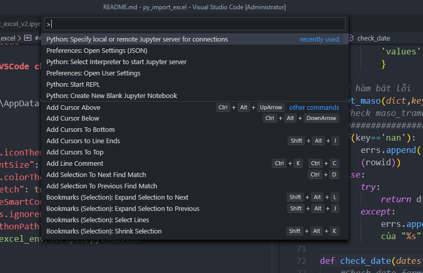
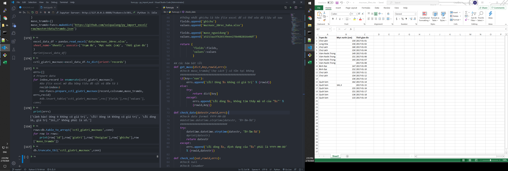

# py_import_excel
py_import_excel

## Tạo môi trường
```cmd
pip install virtualenv
pip install xlrd
```

```python
virtualenv py_import_excel_env

python -m pip install jupyter
jupyter notebook
```

## Cấu hình VSCode

### Kích hoạt VSCode chạy môi trường ảo `virtualenv`

`
C:\Users\soiqu\AppData\Roaming\Code\User\settings.json`

```json
{
    "workbench.iconTheme": "material-icon-theme",
    "editor.fontSize": 18,
    "workbench.colorTheme": "One Dark Pro",
    "git.autofetch": true,
    "git.enableSmartCommit": true,
    "extensions.ignoreRecommendations": true,
    "python.pythonPath": "D:/sync/websvr/python/py_import_excel_env/Scripts/python.exe"
}
```

### Chạy Jupyter của môi trường ảo trong VSCode



https://code.visualstudio.com/docs/python/jupyter-support


### Jupyter reload module when run a cell

```python
import importlib

sys.path.append('lib/')
import Py4Sqlite3 as db
import funcs
importlib.reload(funcs)
```

## Check lỗi dữ liệu Excel

* Check formate date
* Check trạm đo có tồn tại hay không để lấy mã số
* Check giá trị null, là số hay không
    * null vẫn lấy để lưu vào db



### Build services


## References

https://dothanhlong.org/thu-cai-geo-notebook/

https://www.journaldev.com/33306/pandas-read_excel-reading-excel-file-in-python

https://towardsdatascience.com/jypyter-notebook-shortcuts-bf0101a98330

